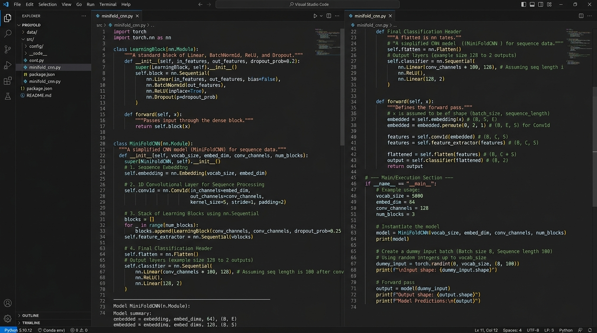
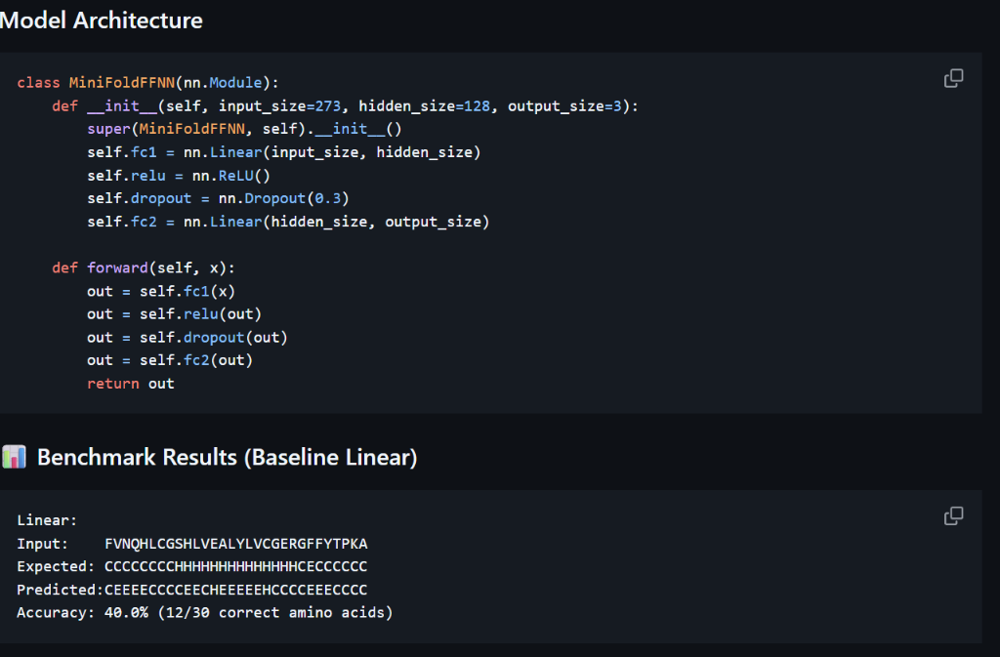

# 2D Protein Structure Prediction (MiniFold)

An AI/Deep Learning repository for predicting secondary protein structures (**Coil `C`**, **Beta-Sheet `E`**, and **Alpha-Helix `H`**) from primary amino acid sequences using PyTorch.

---

## 📊 Model Implementation Comparison Summary

Below is a comparison of all model implementation iterations developed in this repository:

| Implementation Model | Model Architecture | Feature Pipeline | Accuracy | Code & Notebook Reference |
| :--- | :---: | :--- | :---: | :--- |
| **1. Multi_CNN**<br>*(Advanced)* |  | `nn.Embedding` (21 → 32) → `Conv1d` (32 → 128) → `LearningBlock` Stack $\times N$ | **77.78%** | [`minifold_CNN.py`](file:///c:/Users/mannu/2D%20Protien%20Folding/minifold_CNN.py)<br>[`Minifold_MultiLayerCNN.ipynb`](file:///c:/Users/mannu/2D%20Protien%20Folding/Minifold_MultiLayerCNN.ipynb) |
| **2. CNN**<br>*(Baseline)* | 2-Layer 1D Conv1D | 3D One-Hot Grid (21 × 13) → `Conv1d` (64 → 32) → `Linear` | **50.0%** | [`Minifold_baselineCNN.ipynb`](file:///c:/Users/mannu/2D%20Protien%20Folding/Minifold_baselineCNN.ipynb) |
| **3. Linear**<br>*(Baseline)* |  | Flattened One-Hot Vector (273) → `Linear` (273 → 128 → 3) | **40.0%** | [`minifold_linear.py`](file:///c:/Users/mannu/2D%20Protien%20Folding/minifold_linear.py)<br>[`Minifold_Linear.ipynb`](file:///c:/Users/mannu/2D%20Protien%20Folding/Minifold_Linear.ipynb) |
| **4. Transformers**<br>*(Roadmap)* | Self-Attention Encoder | Token + Positional Embeddings + Multi-Head Attention | *Planned* | *Future Work* |

---

## 📌 Project Overview

Proteins are linear chains of amino acids that fold into complex 3D shapes to perform essential biological functions. Predicting secondary structure states (`C`, `E`, `H`) from 1D primary amino acid sequences is a fundamental challenge in computational biology.

This repository implements data preprocessing pipelines and deep learning architectures (**MiniFold**) in PyTorch. It tracks the evolutionary progression from a simple **Linear Layer** model to a **Baseline 2-Layer CNN**, up to an **Advanced Multi-Layer CNN with Configurable Learning Blocks**, and sets the foundation for future **Transformer-based** models.

---

## 📁 Repository Structure & File Inventory

| File | Description |
| :--- | :--- |
| 🚀 [`minifold_CNN.py`](file:///c:/Users/mannu/2D%20Protien%20Folding/minifold_CNN.py) | **Primary Advanced Model**: PyTorch script implementing the Advanced Multi-Layer CNN with `nn.Embedding`, `nn.Sequential`, dynamic `LearningBlock` stacks, `BatchNorm1d`, `ReLU`, and `Dropout`. |
| 🚀 [`Minifold_MultiLayerCNN.ipynb`](file:///c:/Users/mannu/2D%20Protien%20Folding/Minifold_MultiLayerCNN.ipynb) | **Primary Advanced Notebook**: Interactive notebook for training and tuning the Advanced Multi-Layer CNN architecture. |
| 🔹 [`Minifold_baselineCNN.ipynb`](file:///c:/Users/mannu/2D%20Protien%20Folding/Minifold_baselineCNN.ipynb) | **Baseline CNN Notebook**: Notebook implementing the 2-layer Convolutional model (`MiniFoldCNN`) with 3D one-hot grid inputs. |
| 🔹 [`minifold_linear.py`](file:///c:/Users/mannu/2D%20Protien%20Folding/minifold_linear.py) | **Baseline Linear Script**: PyTorch script implementing the baseline fully-connected linear network (`MiniFoldFFNN`). |
| 🔹 [`Minifold_Linear.ipynb`](file:///c:/Users/mannu/2D%20Protien%20Folding/Minifold_Linear.ipynb) | **Baseline Linear Notebook**: Interactive notebook for the baseline linear model. |
| 📄 [`RS126.data.txt`](file:///c:/Users/mannu/2D%20Protien%20Folding/RS126.data.txt) | Benchmark biological dataset of paired primary sequences and secondary structure labels. |
| 🛠️ [`data_prep.py`](file:///c:/Users/mannu/2D%20Protien%20Folding/data_prep.py) | Utility script parsing raw protein text lines into structured DataFrames. |
| 🛠️ [`sliding_window.py`](file:///c:/Users/mannu/2D%20Protien%20Folding/sliding_window.py) | Standalone script demonstrating sequence padding and sliding window generation. |

---

## 🧬 Data Pipeline & Feature Representation

### 1. Vocabulary & Alphabet
Amino acid sequences are tokenized using a 21-character vocabulary consisting of 20 standard amino acids plus an artificial padding character `'X'`:

`Alphabet = "ACDEFGHIKLMNPQRSTVWYX" (21 tokens)`

### 2. Sliding Window Extraction
We slice sequences using a **sliding window of size W = 13**:
- **Padding**: `pad_length = 13 // 2 = 6` characters of `'X'` prepended and appended to each protein sequence.
- **Window Extraction**: For each residue position, a 13-character window centered at that position is extracted.
- **Target Assignment**: The target label $Y$ is the secondary structure character (`C`, `E`, or `H`) of the central residue.

### 3. Encoding Strategies
- **Integer Token Tensors (`minifold_CNN.py`)**: Amino acid strings are mapped directly to 2D integer token matrices `[Batch, 13]` for feeding into `nn.Embedding`.
- **3D One-Hot Grid Tensors (`Minifold_baselineCNN.ipynb`)**: Windows are converted to 3D one-hot matrices `[Batch, 21, 13]` for raw spatial convolutions.
- **1D One-Hot Flattened Vectors (`minifold_linear.py`)**: Windows are flattened into a 1D vector of length `13 * 21 = 273` features for dense linear layers.
- **Class Labels**: `Coil ('C') → 0`, `Strand ('E') → 1`, `Helix ('H') → 2`.

---

## 🚀 1. Advanced Multi-Layer CNN (`MiniFoldCNN` with Dynamic Learning Blocks)

> [!IMPORTANT]
> **Status**: **Latest & Primary Architecture**  
> Implemented in [`minifold_CNN.py`](file:///c:/Users/mannu/2D%20Protien%20Folding/minifold_CNN.py) and [`Minifold_MultiLayerCNN.ipynb`](file:///c:/Users/mannu/2D%20Protien%20Folding/Minifold_MultiLayerCNN.ipynb). This model introduces dense feature embeddings, 1D spatial feature extraction, projection bridges, and configurable, modular `LearningBlock` stacks.

### Model Architecture

```python
class LearningBlock(nn.Module):
    """
    Reusable Learning Block: Linear -> BatchNorm1d -> ReLU -> Dropout
    """
    def __init__(self, input_channels=256, dropout_rate=0.3):
        super(LearningBlock, self).__init__()
        self.linear1 = nn.Linear(input_channels, input_channels)
        self.batch_norm1 = nn.BatchNorm1d(input_channels)
        self.relu = nn.ReLU()
        self.dropout = nn.Dropout(dropout_rate)
    
    def forward(self, x):
        x = self.linear1(x)
        x = self.batch_norm1(x)
        x = self.relu(x)
        x = self.dropout(x)
        return x


class MiniFoldCNN(nn.Module):
    """
    Advanced CNN featuring Embedding, Conv1D, Projection Bridge, 
    and User-Configurable Dynamic LearningBlocks.
    """
    def __init__(self, vocab_size=21, input_channels=32, window_size=13, output_size=3, SequenceCount=3, hidden_dim=256):
        super(MiniFoldCNN, self).__init__()
        
        self.embedding = nn.Embedding(num_embeddings=vocab_size, embedding_dim=input_channels)
        conv_out_channels = 128
        flattened_dim = conv_out_channels * window_size  # 128 * 13 = 1,664
        
        self.layers = nn.Sequential(
            # 1. Feature Extractor (Conv1D)
            nn.Conv1d(in_channels=input_channels, out_channels=conv_out_channels, kernel_size=3, padding=1),
            nn.ReLU(),
            
            # 2. Bridge 3D Grid -> 2D Flat Vector
            nn.Flatten(),
            nn.Linear(flattened_dim, hidden_dim),
            nn.ReLU(),
            
            # 3. Dynamic LearningBlock Stack (User configurable via SequenceCount)
            *[LearningBlock(input_channels=hidden_dim, dropout_rate=0.3) for _ in range(SequenceCount)],
            
            # 4. Final Classification Head
            nn.Linear(hidden_dim, output_size)
        )

    def forward(self, x):
        x = self.embedding(x)  # [Batch, 13] -> [Batch, 13, 32]
        x = x.transpose(1, 2)  # [Batch, 13, 32] -> [Batch, 32, 13]
        x = self.layers(x)     # [Batch, 32, 13] -> [Batch, 3]
        return x
```

### Configurable Hyperparameters for Users
Users can easily adjust depth, regularization, and dimension sizes based on preference:
- `SequenceCount`: Change depth by stacking 1, 3, or 5 `LearningBlock` modules dynamically.
- `input_channels` (Embedding Dimension): Controls token representation capacity (e.g. 16, 32, 64).
- `hidden_dim`: Controls width of dense layers (e.g. 128, 256, 512).
- `dropout_rate`: Regularization tuning (e.g. 0.2, 0.3, 0.5).

### 📊 Benchmark Results (Advanced Multi-Layer CNN)

```text
Multi_CNN:
Input:    SIPPEVKFNKPFVFLMIEQNTKSPLFMGKVVNPTQK
Expected: CCCCEEECCCCEEEEEEECCCCCEEEEEEECCCCCC
Pred:     CCECHCCCHHHEEHHHCCHHHHCECCCCCH
Accuracy: 77.78%
```

---

## 🔹 2. Baseline CNN Model (`MiniFoldCNN` 2-Layer Grid Model)

> [!NOTE]
> **Status**: **Baseline Convolutional Model**  
> Implemented in [`Minifold_baselineCNN.ipynb`](file:///c:/Users/mannu/2D%20Protien%20Folding/Minifold_baselineCNN.ipynb). Serves as a 2-layer Conv1D baseline without embedding layers or dynamic learning blocks.

### Model Architecture

```python
class MiniFoldCNN(nn.Module):
    def __init__(self, output_size=3):
        super(MiniFoldCNN, self).__init__()
        self.conv1 = nn.Conv1d(in_channels=21, out_channels=64, kernel_size=3, padding=1)
        self.relu = nn.ReLU()
        self.dropout = nn.Dropout(0.3)
        self.conv2 = nn.Conv1d(in_channels=64, out_channels=32, kernel_size=3, padding=1)
        self.fc = nn.Linear(32 * 13, output_size)
        
    def forward(self, x):
        x = self.conv1(x)
        x = self.relu(x)
        x = self.dropout(x)
        x = self.conv2(x)
        x = self.relu(x)
        x = x.view(x.size(0), -1)  # Flatten to 416
        out = self.fc(x)
        return out
```

### 📊 Benchmark Results (Baseline CNN)

```text
CNN:
Input Sequence:   FVNQHLCGSHLVEALYLVCGERGFFYTPKA
Expected:  CCCCCCCCHHHHHHHHHHHHHHCECCCCCC
CNN Prediction:   CCEEEECHHHHHHEEEEEECCCCCCCCCCC
Accuracy:         50.0% (15/30 correct amino acids)
```

---

## 🔹 3. Baseline Linear Layer Model (`MiniFoldFFNN`)

> [!NOTE]
> **Status**: **Foundational Baseline Model**  
> Implemented in [`minifold_linear.py`](file:///c:/Users/mannu/2D%20Protien%20Folding/minifold_linear.py) and [`Minifold_Linear.ipynb`](file:///c:/Users/mannu/2D%20Protien%20Folding/Minifold_Linear.ipynb). Uses a flattened 1D one-hot vector representation (`13 * 21 = 273`) passed into dense linear layers.

### Model Architecture

```python
class MiniFoldFFNN(nn.Module):
    def __init__(self, input_size=273, hidden_size=128, output_size=3):
        super(MiniFoldFFNN, self).__init__()
        self.fc1 = nn.Linear(input_size, hidden_size)
        self.relu = nn.ReLU()
        self.dropout = nn.Dropout(0.3)
        self.fc2 = nn.Linear(hidden_size, output_size)
        
    def forward(self, x):
        out = self.fc1(x)
        out = self.relu(out)
        out = self.dropout(out)
        out = self.fc2(out)
        return out
```

### 📊 Benchmark Results (Baseline Linear)

```text
Linear:
Input:    FVNQHLCGSHLVEALYLVCGERGFFYTPKA
Expected: CCCCCCCCHHHHHHHHHHHHHHCECCCCCC
Predicted:CEEEECCCCEECHEEEEEHCCCCEEECCCC
Accuracy: 40.0% (12/30 correct amino acids)
```

---

## 🔮 4. Future Work: Transformer Architecture

> 🚧 **Roadmap Feature**: Future iterations will explore multi-head self-attention Transformer Encoders (inspired by ESM & AlphaFold) to capture long-range contextual dependencies across whole protein chains beyond local 13-residue windows.

---

## 🛠️ Installation & Execution

### Prerequisites
```bash
pip install torch pandas numpy
```

### Execution Commands
- **Run Advanced Multi-Layer CNN (Recommended)**:
  ```bash
  python minifold_CNN.py
  ```
- **Run Baseline Linear Model**:
  ```bash
  python minifold_linear.py
  ```
- **Jupyter Notebooks**: Launch [`Minifold_MultiLayerCNN.ipynb`](file:///c:/Users/mannu/2D%20Protien%20Folding/Minifold_MultiLayerCNN.ipynb), [`Minifold_baselineCNN.ipynb`](file:///c:/Users/mannu/2D%20Protien%20Folding/Minifold_baselineCNN.ipynb), or [`Minifold_Linear.ipynb`](file:///c:/Users/mannu/2D%20Protien%20Folding/Minifold_Linear.ipynb).
